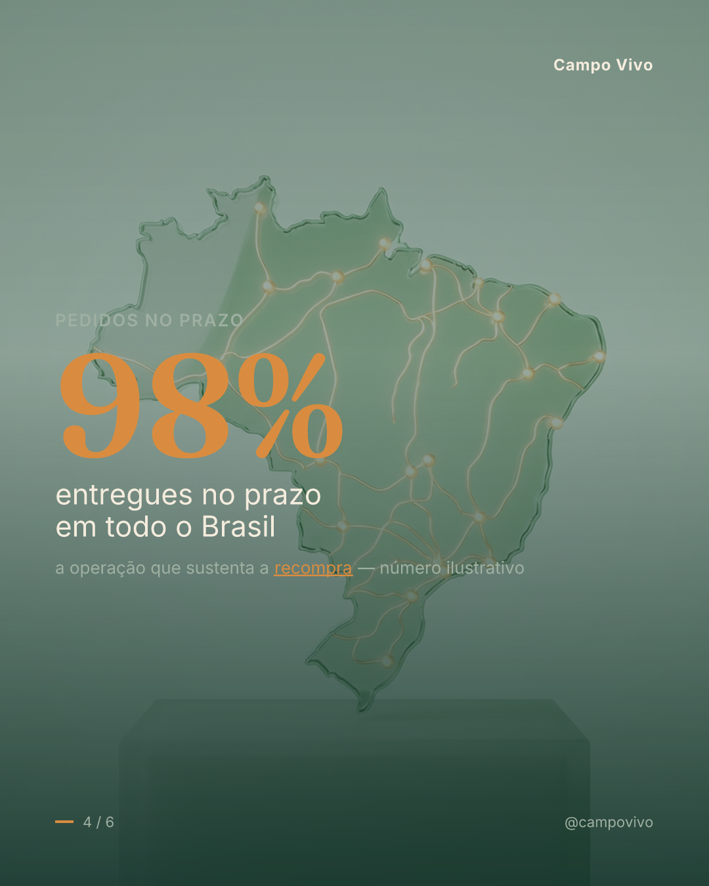

<p align="center">
  
</p>

<h1 align="center">🌱 Postcraft</h1>

<p align="center"><b>Transforma tudo que uma empresa é em público no conteúdo visual que o comprador dela quer ver.</b></p>

<p align="center">inteligência da empresa → <i>ICP editável</i> → pesquisa de concorrentes → carrosséis prontos pra postar</p>

<p align="center">
  
  
  
  = 20" />
  
</p>

<p align="center">
  🌐 <a href="https://luigiluft.github.io/postcraft-site/"><b>Site</b></a> ·
  🧩 <a href="#-instalar-no-claude-code">Instalar no Claude Code</a> ·
  🚀 <a href="#-começo-rápido">Começo rápido</a> ·
  🛠️ <a href="#-como-funciona">Como funciona</a>
</p>

---

A Postcraft lê **tudo que a empresa já comunica** — site, notícias, redes, kit de marca —, descobre **quem compra e o que essa pessoa quer ler**, estuda **referências globais + concorrentes locais**, e entrega **kits prontos pra postar**: carrosséis slide a slide com copy, fundo gerado por IA, legendas, **o logo da marca** e os PNGs 1080×1350.

> **Grátis e open-source.** Feito pra amigos usarem, forkarem e melhorarem. 🌱

## 🎬 Veja funcionando — saída real

Gerado de ponta a ponta para a **Campo Vivo**, uma marca fictícia de exemplo (full-commerce do agronegócio): do site → ICP → concorrentes → carrossel. A IA faz o **fundo**; uma camada determinística desenha o **texto** (sempre nítido).

<p align="center">
  
  
  
  
</p>

## ✨ Destaques

- **ICP editável como motor** — não é "escolha um público": é o comprador real (dores, vocabulário literal, objeções, gatilhos, prova) re-mirando cada post.
- **Art direction por slide** — cada slide com a sua anatomia (capa ≠ stat ≠ quote ≠ CTA). O oposto de um template estampado 6×.
- **Pesquisa visual de concorrentes** fundida na geração.
- **Texto + logo sempre nítidos** — IA só no fundo; tipografia determinística por cima (sem gibberish).
- **Logo da empresa extraído automático** do site (com override manual).
- **Provider-agnostic** — Firecrawl / Anthropic / Apify / Higgsfield · fal, atrás de adapters (modo fixture roda com zero key).
- **Roda como skill do Claude Code** ou como CLI/biblioteca TypeScript.

## 🧩 Instalar no Claude Code

A forma mais fácil de usar: a Postcraft vira uma **skill**.

```bash
# 1) clone e instale o motor
git clone https://github.com/luigiluft/postcraft
cd postcraft && npm install

# 2) instale a skill no Claude Code
#    macOS / Linux:
cp -r skills/postcraft ~/.claude/skills/postcraft
#    Windows (PowerShell):
#    Copy-Item -Recurse skills\postcraft "$env:USERPROFILE\.claude\skills\postcraft"
```

3. Reabra o Claude Code e use em linguagem natural:

```
postcraft Campo Vivo
# ou: "cria um carrossel da <empresa>"  ·  "gera conteúdo pra <domínio>"
```

A skill orquestra as suas ferramentas MCP (Firecrawl, Apify, Higgsfield) + o renderer do repo. Quando perguntar, diga onde clonou o motor (`POSTCRAFT_DIR`). Sem nenhuma MCP, ainda dá pra ver tudo com `npm run demo`.

## 🗂️ Skills

A skill vive em [`skills/postcraft/SKILL.md`](skills/postcraft/SKILL.md). Contrato:
- **frontmatter:** `name`, `description` (com os gatilhos de ativação).
- **fluxo:** COLETA → ENTENDE → PESQUISA → GERA → RENDERIZA, com 1 gate humano antes de entregar.
- **regras:** prova classificada (nunca inventa número), texto nunca dentro da imagem, logo sempre nítido, imagem autêntica ao contexto.
- lê `.env` / pergunta as keys; degrada com elegância se faltar MCP.

## ⚙️ Configuração (`.env`)

Cada etapa usa o provider quando a key existe, senão cai no **fixture** (zero key). Copie e preencha:

```bash
cp .env.example .env
```

| Variável | Habilita |
|---|---|
| `ANTHROPIC_API_KEY` | inteligência · pesquisa · geração |
| `FIRECRAWL_API_KEY` | coleta (site · notícias · marca/logo) |
| `APIFY_TOKEN` | coleta (redes sociais) |
| `FAL_KEY` ou `IDEOGRAM_API_KEY` | fundos por IA |

> Nunca comite segredos — `.env` está no `.gitignore`.

## 🚀 Começo rápido

```bash
npm run demo                      # zero keys → carrosséis de exemplo em runs/
npm test                          # testes
# marca real (keys no .env):
npm run cli -- run --name "Acme" --domain acme.com --instagram @acme --competitors "@r1,@r2"
# renderizar um spec autorado/editado (reusa fundos, não regasta crédito):
tsx examples/render-spec.ts examples/demo.spec.json "Campo Vivo" runs/out caminho/logo.png
```

## 🛠️ Como funciona

A capa acima é o fluxograma. Em texto:

```
   Empresa (nome, domínio, @perfis, concorrentes)
        │
   ① COLETA       site · notícias · redes · kit de marca + logo       → Footprint
   ② ENTENDE      posicionamento · voz · ICP · pilares · prova        → Inteligência + ICP
   ③ PESQUISA     referências globais + concorrentes (visual)         → Playbook visual
   ④ GERA         conceitos → spec do carrossel + briefs de imagem    → Carrossel-spec
   ⑤ RENDERIZA    fundo por IA (sem texto) + tipografia + logo        → Kit (PNGs)
```

**Tese híbrida:** modelos de IA não acertam texto ao longo de 6 slides — então a IA gera só o **fundo** e o **Satori → PNG** desenha texto + logo legíveis por cima.

Detalhes: [ARCHITECTURE](docs/ARCHITECTURE.md) · [PIPELINE](docs/PIPELINE.md) · [ROADMAP](docs/ROADMAP.md)

## 🗺️ Mapa do repositório

```
src/         o motor — tipos (Zod) · gramática de carrossel · prompts · pipeline · adapters
skills/      a skill do Claude Code (postcraft/SKILL.md)
examples/    render-spec · demo.spec.json (carrossel real)
landing/     página do produto (HTML self-contained, publicada como site)
docs/        arquitetura · pipeline · roadmap · research
bin/         CLI
```

## 🤝 Contribuindo

PRs e issues são bem-vindos — veja [CONTRIBUTING.md](CONTRIBUTING.md). Ideias fáceis: novos arquétipos de slide, adapters, skins de render, idiomas.

## 📄 Licença

MIT © Luigi Luft — use, forke, melhore. Veja [LICENSE](LICENSE).

---

<p align="center"><i>Prefere que façam por você? Tem a opção done-for-you no <a href="https://luigiluft.github.io/postcraft-site/">site</a>.</i></p>
