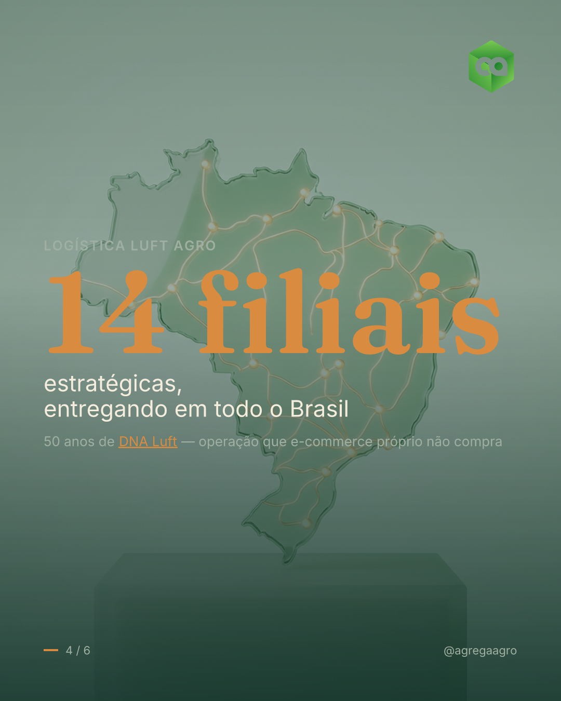

<p align="center">
  
</p>

<h1 align="center">Postcraft</h1>

<p align="center"><b>Transforma tudo que uma empresa é em público no conteúdo visual que o comprador dela quer ver.</b></p>

<p align="center">inteligência da empresa → <i>ICP editável</i> → pesquisa visual de concorrentes → carrosséis prontos pra postar</p>

<p align="center">
  🌐 <b><a href="https://luigiluft.github.io/postcraft-site/">Página do produto (landing)</a></b> ·
  💰 <a href="docs/SELLING.md">Como vender</a> ·
  🛠️ <a href="docs/OPERATING.md">Como operar</a>
</p>

---

A Postcraft lê **tudo que a empresa já comunica** — site, notícias, redes, kit de marca —, descobre **quem compra e o que essa pessoa quer ler**, estuda **referências globais + concorrentes locais**, e entrega **kits de conteúdo prontos pra postar**: carrosséis slide a slide com copy, fundo gerado por IA, legendas, o logo da marca e os PNGs 1080×1350 renderizados.

É a generalização de um motor feito à mão (pro Agrega) num **produto provider-agnostic** que já roda de ponta a ponta.

## Veja funcionando — saída real

Gerado de ponta a ponta para a **Agrega Agro** (full-commerce do agronegócio), a partir do site real + um ICP derivado + pesquisa dos concorrentes. A IA faz os fundos (Higgsfield); uma camada determinística desenha o texto + logo, então fica sempre nítido.

<p align="center">
  
  
  
  
</p>

## O diferencial (por que isso, e não AdCreative / Predis / Jasper)

O mercado se divide em quatro campos e **nenhum domina o ciclo inteiro**:

1. **Inteligência da empresa → ICP editável como motor.** Não é “escolha um público” — é um modelo do comprador real (dores, vocabulário literal, objeções, gatilhos, prova) que re-mira cada post.
2. **Art direction por slide.** Cada slide tem a sua anatomia (capa ≠ stat ≠ quote ≠ CTA). O oposto de um template estampado 6×.
3. **Pesquisa visual de concorrentes fundida na geração.** A linguagem visual dos rivais + referências globais vira tokens de design que dirigem a saída.

## Como funciona

```
   Empresa (nome, domínio, @perfis, concorrentes)
        │
   ① COLETA       site · notícias · redes · kit de marca           → Footprint
   ② ENTENDE      posicionamento · voz · ICP · pilares · prova     → Inteligência + ICP
   ③ PESQUISA     referências globais + concorrentes (visual)      → Playbook visual
   ④ GERA         conceitos → spec do carrossel + briefs de imagem → Carrossel-spec
   ⑤ RENDERIZA    fundo por IA (sem texto) + tipografia + logo     → Kit (PNGs)
```

**Tese híbrida (validada):** modelos de IA não acertam texto ao longo de 6 slides — então a IA gera só o **fundo** e uma camada determinística (Satori → PNG) desenha o **texto + logo legíveis** por cima. (É literalmente o que a capa acima ilustra.)

## Começo rápido

```bash
npm install
npm run demo                      # zero keys → dados fixture + renderer real → runs/
npm test                          # 5 testes
# marca real (keys no .env) OU renderizar um spec autorado:
npm run cli -- run --name "Acme" --domain acme.com --instagram @acme --competitors "@r1,@r2"
tsx examples/render-spec.ts examples/agrega-agro.spec.json "Agrega Agro" runs/out caminho/logo.png
```

As fontes baixam sozinhas em `.fonts/` no primeiro render.

## O teste real (Agrega Agro) — passo a passo

1. **Descoberta:** identifiquei domínio (`agro.agrega.com.br`), Instagram (`@agrega.agro`) e 2 concorrentes (Orbia, Agrofy).
2. **Coleta:** li o site real (SPA renderizado) + ICP do comprador agro + leitura visual dos concorrentes.
3. **Inteligência:** ICP = “dono de revenda / gestor de cooperativa que quer vender insumos online sem virar empresa de tecnologia e logística”; prova *public-verifiable* (14 filiais Luft Agro, 50 anos, entrega nacional).
4. **Conceito:** “No agro, o digital não substitui a relação — fortalece” (ancorado no posicionamento real deles).
5. **Geração + render:** 6 slides com fundos Higgsfield (soja no Cerrado, etnia BR, colheitadeira, pivôs, arara-canindé) + texto/logo nítidos.

→ Spec do exemplo: [`examples/agrega-agro.spec.json`](examples/agrega-agro.spec.json)

## Preço — vende **hoje** como serviço produtizado

Você roda o motor + aplica os gates de qualidade e entrega os kits prontos. (SaaS self-serve é a fase 2 — ver roadmap.)

| Plano | Preço (BRL) | Entrega |
|---|---|---|
| **Diagnóstico** (porta de entrada) | R$ 990 único | Inteligência + ICP editável + playbook visual + 2 carrosséis |
| **Starter** | R$ 1.490/mês | 1 marca · 8 posts (~R$186/post) · 1 rodada |
| **Studio** ⭐ | R$ 2.990/mês | 1 marca · 20 posts (~R$150/post) · pesquisa de concorrentes · 2 rodadas |
| **Agência / White-label** | a partir de R$ 6.000/mês | múltiplas marcas · white-label · aprovação |

Pix ou cartão · foco: B2B BR + agências · outbound founder-led · **fechamento via carrossel de teste grátis**.

→ **Página de vendas (cliente):** https://luigiluft.github.io/postcraft-site/ · **como vender (scripts):** [`docs/SELLING.md`](docs/SELLING.md) · **como entregar:** [`docs/OPERATING.md`](docs/OPERATING.md)

## Mapa do repositório

```
src/         o motor — tipos (Zod) · gramática de carrossel · prompts · pipeline · adapters
landing/     página de vendas + preços (HTML self-contained, publicada como site)
examples/    run-demo · render-spec · agrega-agro.spec.json (carrossel real)
docs/        RESEARCH · PRODUCT · SELLING · OPERATING · ARCHITECTURE · PIPELINE · ROADMAP
bin/         CLI
```

Tudo que é externo (scraper · social · LLM · imagem · renderer) fica atrás de um **adapter** com versão fixture (zero key) e live — troca qualquer provider sem mexer no pipeline.

## Status — está pronto?

- ✅ **Pronto pra vender como serviço agora.** Provado de ponta a ponta numa empresa real (Agrega Agro): coleta real → ICP → spec → fundos Higgsfield → carrosséis na marca, com logo, prontos pra postar. Motor roda (`npm run demo`), testes verdes (`npm test`), typecheck limpo.
- 🔜 **Ainda não é SaaS self-serve** — sem web app / cobrança / multi-tenant (roadmap v0.3–v0.4).
- ⚠️ **Adapters live esboçados, não validados** — as etapas de coleta/IA têm sido rodadas via ferramentas do operador; validar os endpoints (Firecrawl/Anthropic/Apify) contra a doc atual antes de um pipeline 100% automático cobrar cliente.

## Docs

[ARCHITECTURE](docs/ARCHITECTURE.md) · [PIPELINE](docs/PIPELINE.md) · [PRODUCT](docs/PRODUCT.md) · [SELLING](docs/SELLING.md) · [OPERATING](docs/OPERATING.md) · [ROADMAP](docs/ROADMAP.md) · [RESEARCH](docs/RESEARCH.md)
